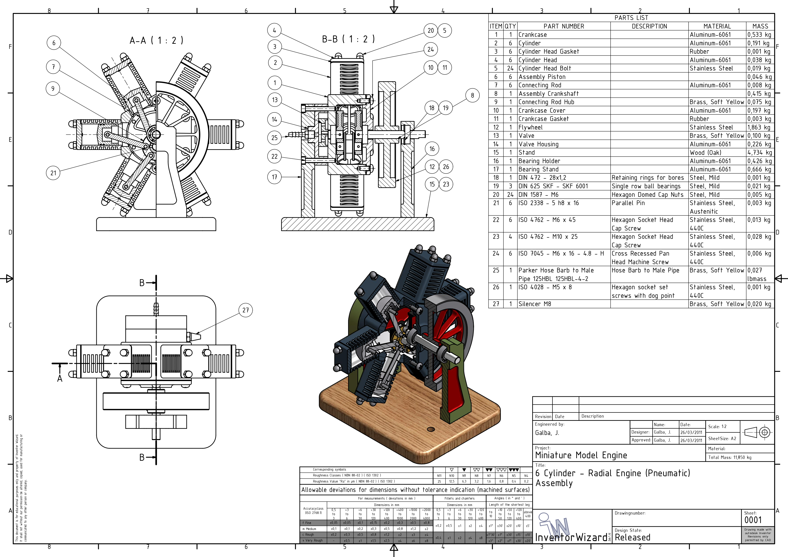

# 🔧 6-Cylinder Radial Engine – SolidWorks Assembly

This project presents a high-precision mechanical design of a **6-cylinder radial engine**, developed using **SolidWorks** and documented with a full Bill of Materials (BOM), section views, and part callouts. The engine is designed for **pneumatic operation** and follows standard mechanical tolerancing practices.

---

## 📄 Overview

- **Project Title:** Miniature Model Engine (Pneumatic)
- **Engine Type:** 6-Cylinder Radial
- **CAD Tool:** SolidWorks (original), exported as PDF
- **Designed By:** Sudip Neupane
- **Drawing Format:** A2, Scale 1:2
- **Total Mass:** 11.850 kg
- **Material Variety:** Aluminum-6061, Stainless Steel, Brass, Rubber, Wood

---

## 🧩 Bill of Materials – Sample

| Item | Description                  | Material                  | Qty | Mass     |
|------|------------------------------|---------------------------|-----|----------|
| 1    | Crankcase                    | Aluminum-6061             | 1   | 0.533 kg |
| 6    | Cylinder Head Bolts          | Stainless Steel           | 24  | 0.019 kg |
| 8    | Crankshaft (Assembly)        | -                         | 1   | 0.415 kg |
| 15   | Stand                        | Wood (Oak)                | 1   | 4.734 kg |
| 24   | Machine Screw (M6x16)        | Stainless Steel 440C      | 6   | 0.006 kg |

> Full BOM in PDF

---

## 📁 Files

 

---

## 🛠 Tools & Skills

- **CAD Design:** SolidWorks  
- **Mechanical Detailing:** Section Views, ISO Tolerances, Surface Finish Symbols  
- **Bill of Materials (BOM)**  
- **Drafting Standards:** ISO 2768, ISO 1302

---

## 📬 Contact

Sudip Neupane  
📧 neupane.sudip22@gmail.com  
🔗 [LinkedIn Profile](www.linkedin.com/in/sudip-neupane99
)

---

## 🧷 License

This content is for educational and portfolio use. All credit for original drawing design goes to **Sudip Neupane**  
Created using SolidWorks | Educational purpose only.
